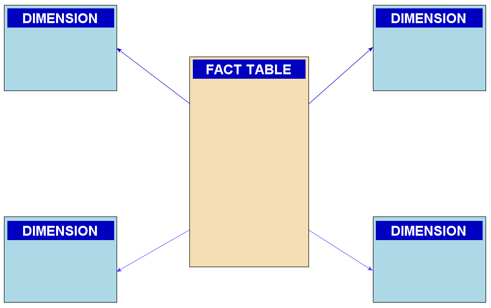
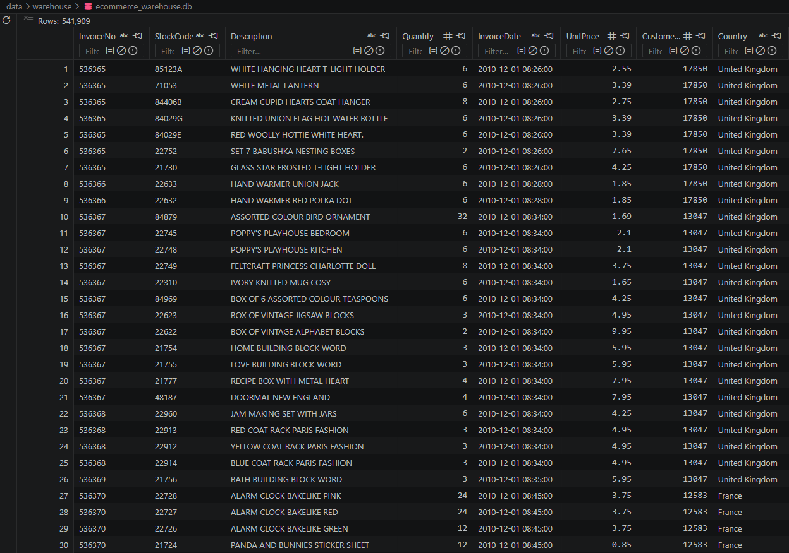
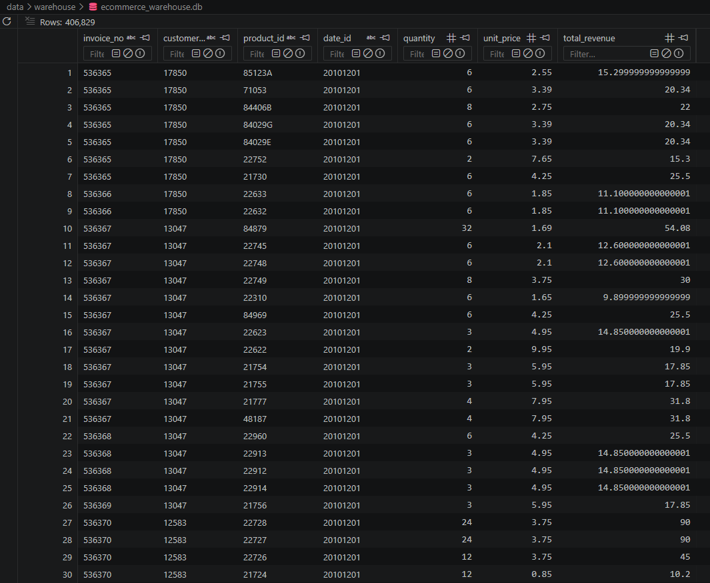
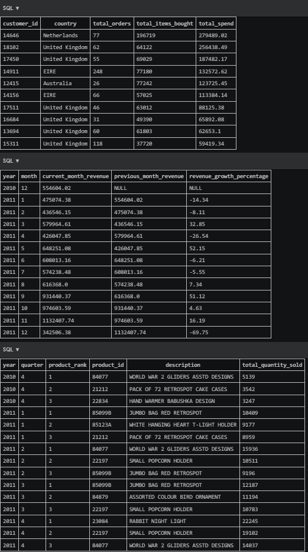
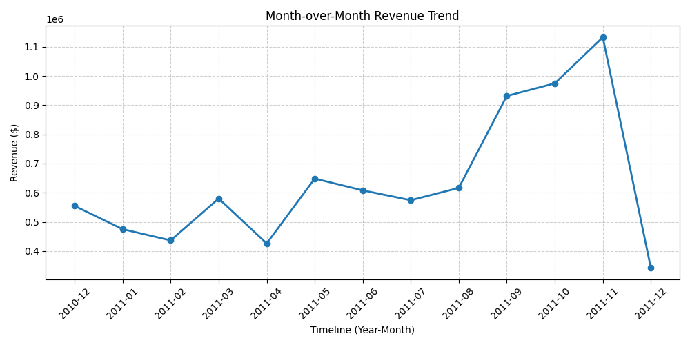
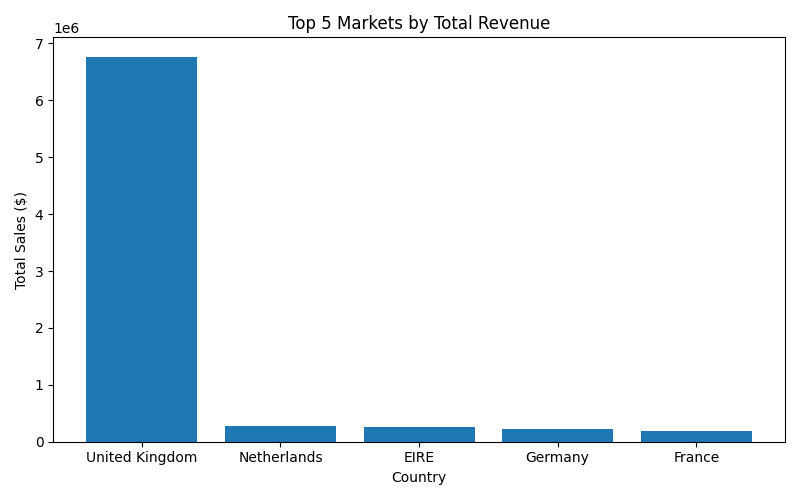
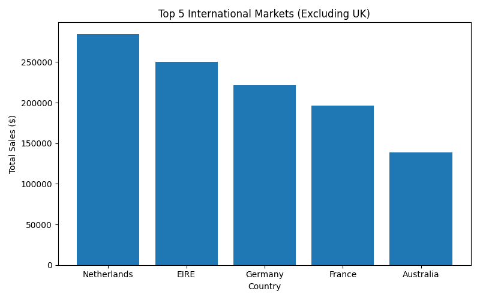

# Data-Product-Project

This project was built as a practice application to design, implement, and document an end-to-end data engineering lifecycle. It simulates a production data engineering workflow by transforming raw, messy transactional retail data—sourced from Kaggle's [Online Retail Dataset](https://www.kaggle.com/datasets/ulrikthygepedersen/online-retail-dataset) into an optimized, relational Star Schema data warehouse using SQLite and Python.

The goal of this repository is to demonstrate practical knowledge of the ETL (Extract, Transform, Load) pipeline architecture, analytical SQL modeling, and automated business intelligence reporting.

## 1. Architecture & Data Architecture Design

### The Star Schema
To minimize data redundancy and maximize query performance, the database structure transitions from a flat, single-table layout into a centralized **Star Schema**. 

*   **Fact Table:** `fact_retail_sales` (Stores transactional numeric quantitative values: quantities, unit prices, and calculated total revenue metrics).
*   **Dimension Tables:** `dim_customers` (Geographic context), `dim_products` (Stock item text descriptions), and `dim_date` (Time hierarchies for trend grouping).


*Image of the Star schema from Wikipedia*

---

## 2. Data Processing

Here is a visual breakdown of how the data changes states at different points in the processing lifecycle.

### Phase 1: The Raw Input State
The data starts as a giant, unstructured, flat file with missing fields, inconsistent dates, and redundant rows. 
*   **Database Checkpoint:** `ecommerce_warehouse.db` contains basic staging tables before relational separation.
<br>

  
    *Image of the Raw messy Data*

### Phase 2: The Clean Data Product Schema
Running the pipeline processes the rows via `pandas`, drops null values, enforces proper data types, separates strings from numeric entities, and populates them into the Star Schema tables.
*   **Database Checkpoint:** Relational breakdown showing separate tables for Facts and Dimensions. <br>
<br>

  
    *Image of the fact_retail_sales*

### Phase 3: Analytical SQL Querying
Using analytical queries directly against the database allows us to extract deep performance metrics dynamically without altering the core warehouse structure.
*   **Database Checkpoint:** Query results panel displaying business calculations.
<br>

   <br>
    *Image of the 3 analytical SQL Tables*

---

## 3. Technical Stack & Execution

*   **Language:** Python 3.11
*   **Data Manipulation:** pandas
*   **Database Engine:** SQLite
*   **Visualization Engine:** matplotlib

### How to Run the Infrastructure

1. **Install Prerequisites:** <br>
   This installs the essential data manipulation and plotting libraries required to execute the pipeline:
```bash
pip install pandas matplotlib
```
2. **Initialize the Warehouse and Execute ETL:** <br>
This script sets up the database schema, cleans the raw dataset, and populates the Star Schema tables:
```bash
python src/python/build_warehouse.py
```
3. **Automate Executive Visualization Dashboards:** <br>
This script queries the finished warehouse to extract metrics and generate visual analysis charts:
```bash
python src/python/generate_dashboard.py
```

## 4. Automated Business Intelligence Figures

The Python visualization engine automatically processes queries under the hood and saves executive charts to the `reports/figures/` folders.

### Chart A: Month-over-Month Revenue Trend Analysis
Utilizes SQL `LAG()` window functions within Common Table Expressions (CTEs) to isolate financial growth over consecutive months.



### Chart B: Top Performing Global Markets
Because the United Kingdom represents the vast majority of transactional volume, the analysis is split into two viewpoints to prevent skewed scaling and clearly isolate international market distribution.

#### Global Market Share (Including UK)
Isolates total high-value transaction volume globally, highlighting the dominance of the primary domestic market.



#### International Market Expansion (Excluding UK)
By removing the UK, this chart rescales the visual axis to reveal granular performance trends and revenue distributions across active international territories like the Netherlands, EIRE (Ireland), Germany, France and Australia.



### Chart C: Shifting Product Demand by Cohort Quarter
Utilizes `DENSE_RANK() OVER (PARTITION BY year, quarter ORDER BY SUM(quantity) DESC)` to isolate shifting seasonal consumer demand.

| Year | Quarter | Product Rank | Product ID | Description | Total Sold |
|------|---------|--------------|------------|-------------|------------|
| 2011 | Q1      | 1            | 85123A     | WHITE HANGING HEART T-LIGHT | 11,413     |
| 2011 | Q1      | 2            | 22423      | REGENCY CAKESTAND 3 TIER    | 3,624      |
| 2011 | Q2      | 1            | 23166      | MEDIUM CERAMIC TOP STORAGE  | 74,215     |
